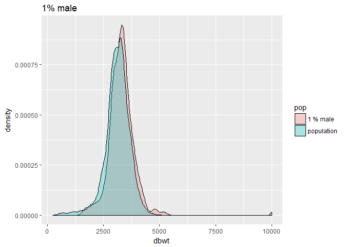
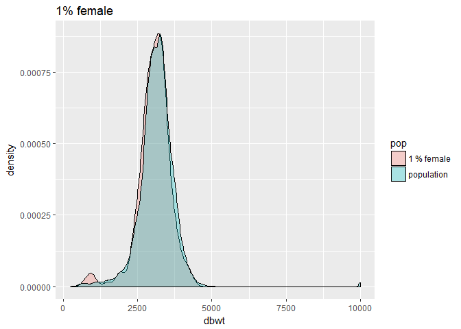
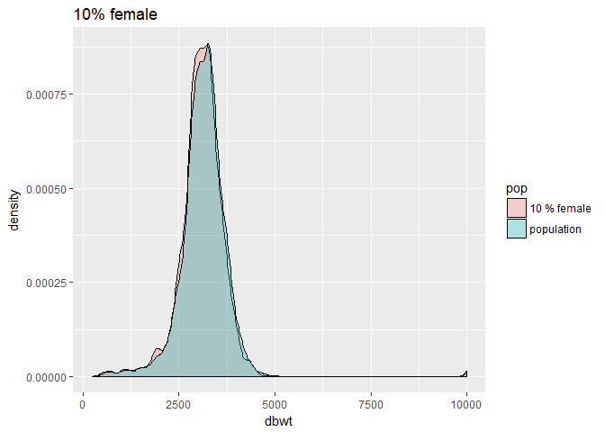
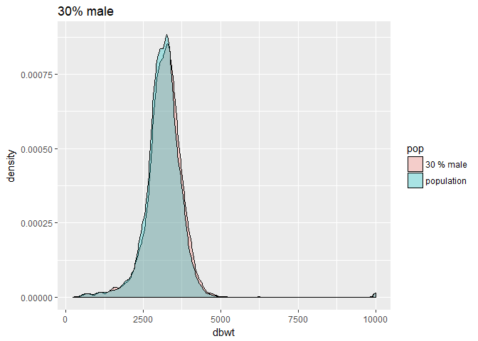
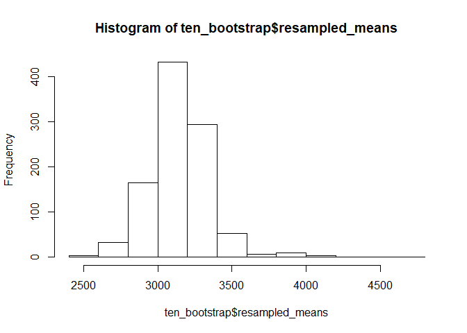
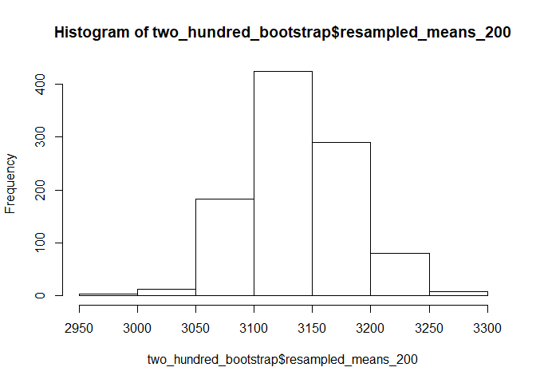
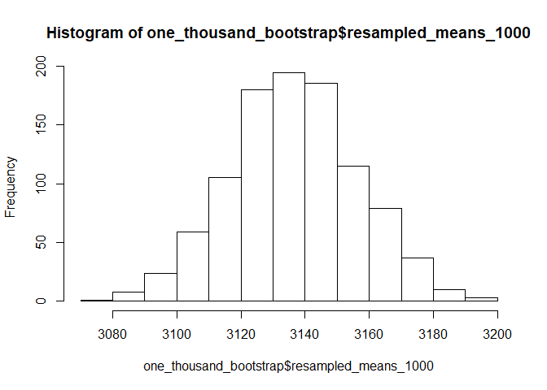
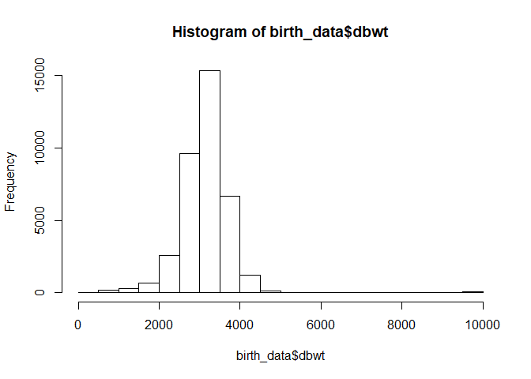

Birth Data
================

``` r
set.seed(100)
```

``` r
library(dplyr)
```

    ## 
    ## Attaching package: 'dplyr'

    ## The following objects are masked from 'package:stats':
    ## 
    ##     filter, lag

    ## The following objects are masked from 'package:base':
    ## 
    ##     intersect, setdiff, setequal, union

Instructions:
-------------

The goal of this lab is to show how to take a sample from a population and how the sample is used to calculate summary statistics to make inference about the population. - Get the birth data for a small state (say Rhode Island) from this link by the CDC: <https://www.cdc.gov/nchs/data_access/vitalstatsonline.htm>

Overview of this assignment:
----------------------------

-We would like to have several babies in each county, so we could also use this dataset to talk about multistage and stratified sampling designs - then we will take simple random sample of different sizes, 1%, 5%, say (but can use larger % if data frame is smaller) - calculate summary stats for entire population vs. the sample (prevalence for binary variables, medians for gestational age and birthweight) - goal is to see that summary stats for sample deviate more from the population when the sample size is "too small

First, read in the file using readr and assign it to a variable called birth\_data

``` r
birth_data <- read.csv(file="natlterr2015_cleaned.csv", header=TRUE, sep=",")
```

Extract the following variables: babyID, birthweight (continuous in grams), gestational age (in completed weeks), sex, birth.month, county. Assign them all to a variable, and observe their values.

``` r
babyID <- birth_data$X
birthweight <- birth_data$dbwt
gestational_age <- birth_data$combgest
sex <- birth_data$sex
county <- birth_data$cig_rec
birth_month <- birth_data$dob_mm
```

In this lab, we will learn how to calculate summary statistics for the population and use different sampling methods to take samples of different sizes to estimate the population's summary statistics. We will learn how different sample sizes' distsribution of the test statistics deviate from the original population and which sample sizes are "good" estimates of the original population.

``` r
##Just for my own observation
max(birth_data$dbwt)  #9999
```

    ## [1] 9999

``` r
min(birth_data$dbwt)  ##227
```

    ## [1] 227

Let us observe the distribution of median birthweights for the population. Run the cell beloW to observe a histogram of birthweights:

``` r
hist(birth_data$dbwt)
```


We observe that this distribution looks roughly normal.

Before we get into the different samples, let us calculate the population median of the distribution of birthweights of the original population:

``` r
median(birth_data$dbwt)       #3147
```

    ## [1] 3147

The two methods we will be learning about in this lab will be stratified sampling (without replacement) and bootstrapping (with replacement) to get an idea of the distribution of median birthweight of the babies.

Sampling method \#1: Stratified sampling
----------------------------------------

The method of stratification involves separating our population into different groups known as strata. The different groups are split according to a certain characteristic. For example, if we want to split a classroom of 30 people up into groups, we can split them up based on ethnicity: one group for Asians, one for whites, and one for blacks. After splitting them up, we select a simple random sample from each group to test some statistic and compare for each group.

In order to illustrate the process of stratification, let us subset our data into two groups: one for males, and one for females. Set the variable males equal to the birth data frame subsetted with only the male babies, and set females equal to the data frame subsetted with only the female babies.

``` r
males <- birth_data[birth_data$sex == 'M',]  ##18903 rows
females <- birth_data[birth_data$sex == 'F',]  ##17821 rows
```

Next, we will take simple random samples of different sizes from each group. Let's take samples (without replacement) of sizes 1%, 10%, and 30% from both of the subsetted data frames.

Write a function called simple\_random\_sample that takes in two arguments: a subsetted data frame (male or female), and the percent in decimal form. It should return a new data frame with the resampled data. Hint: the sample\_n function in the dplyer package will be useful in the body of the function. You can check its documentation by typing ?sample\_n in your console to see description, arguments, and examples:

After writing your function, call your function with the male and female subsetted data frames with each of the percentages above. Assign them all to a variable. You should have 6 variables in total, one for each subsetted data frame with the different sample size percentages.

``` r
simple_random_sample = function(data_frame, sample_size) {
  subsetted_data_frame = sample_n(data_frame, 18903 * sample_size, replace = F)
  return (subsetted_data_frame)
}
```

``` r
##1%:
one_percent_male <- simple_random_sample(males, .01)
one_percent_females <- simple_random_sample(females, .01)

##10%:
ten_percent_male <- simple_random_sample(males, .10)
ten_percent_females <- simple_random_sample(females, .10)

##30%:
thirty_percent_male <- simple_random_sample(males, .30)
thirty_percent_females <- simple_random_sample(females, .30)
```

Now, let's compute the medians of each of our data frames. Make a vector for the different percentages that contains the median for the males and females (you should have three vectors). Hint: the concatenate function will be useful for

``` r
one_percent_array = c(median(one_percent_male$dbwt), median(one_percent_females$dbwt))
one_percent_array
```

    ## [1] 3289 3090

``` r
ten_percent_array = c(median(ten_percent_male$dbwt), median(ten_percent_females$dbwt))
ten_percent_array
```

    ## [1] 3204 3118

``` r
thirty_percent_array = c(median(thirty_percent_male$dbwt), median(thirty_percent_females$dbwt))
thirty_percent_array
```

    ## [1] 3204 3118

Let's generate histograms for our subsetted histograms. Overlap all the histograms with the original unsubsetted data together to compare the distributions.

The first step is to combine your two dataframes into one. First, make a new column in each that will be a variable to identify where they came from later.

``` r
birth_data$pop <- 'population'
one_percent_male$pop <- '1 % male'
```

Now, use the rbind command to comebine your two data frames together.

``` r
one_percent_frame <- rbind(birth_data, one_percent_male)
```

Now, ggplot to create a histogram of the two in one plot. Note: the geom\_density plot will be helpful, and the fill acessory will be helpful in distinguishing between the population histogram from the 5% sample histogram. Create a useful title with 'ggtitle'.

``` r
library(ggplot2)
ggplot(one_percent_frame, aes(dbwt, fill = pop)) + geom_density(alpha = 0.3) + ggtitle("1% male")
```



Run the rest of the cells to view the histograms for the rest of the tables. They follow the same process as above.

``` r
##1% females
one_percent_females$pop <- '1 % female'
one_percent_female_frame <- rbind(birth_data, one_percent_females)
ggplot(one_percent_female_frame, aes(dbwt, fill = pop)) + geom_density(alpha = 0.3) + ggtitle("1% female")
```



``` r
##10%
##male:
ten_percent_male$pop <- '10 % male'
ten_percent_male_frame <- rbind(birth_data, ten_percent_male)
ggplot(ten_percent_male_frame, aes(dbwt, fill = pop)) + geom_density(alpha = 0.3) + ggtitle("10% male")
```


``` r
##10%
##female:
ten_percent_females$pop <- '10 % female'
ten_percent_females_frame <- rbind(birth_data, ten_percent_females)
ggplot(ten_percent_females_frame, aes(dbwt, fill = pop)) + geom_density(alpha = 0.3) + ggtitle("10% female")
```



``` r
##30%
##male:
thirty_percent_male$pop <- '30 % male'
thirty_percent_male_frame <- rbind(birth_data, thirty_percent_male)
ggplot(thirty_percent_male_frame, aes(dbwt, fill = pop)) + geom_density(alpha = 0.3) + ggtitle("30% male")
```



``` r
##30%
##female:
thirty_percent_females$pop <- '30 % female'
thirty_percent_female_frame <- rbind(birth_data, thirty_percent_females)
ggplot(thirty_percent_female_frame, aes(dbwt, fill = pop)) + geom_density(alpha = 0.3) + ggtitle("30% female")
```


What do you notice as the sample size increases? Answer: We notice that as the sample size percentage increases, the histogram looks more and more like the original population histogram. There is less variability.

Sampling method \#2: The Bootstrap
----------------------------------

We will now illustrate the second method of sampling: the bootstrap. Suppose we weren't able to find out every baby's birthweight (perhaps it was too costly). Instead, we can take a subset of size 'n' from our data and generate different samples of that size many, many with replacement. We would like to quantify and give some error to our estimate. The purpose is to estimate some population parameter. For the purposes of the next section, we will estimate the population mean.

To illustrate the bootstrap, let's take samples of sizes 10, 200, and 1000 from our original sample, and generate different samples from each with replacement many, many times (say, 1000) for each and calculating the mean of each sample. Run these cells to see the histograms of the different resamples. (Note: This is the exact same process as in Python, except in R syntax!)

``` r
##sample of size 10:
resampled_means <- vector()
for (i in seq(1, 1000)) {
  resampled_births <- sample_n(birth_data, 10, replace = T)$dbwt
  means <- mean(resampled_births)
  resampled_means <- append(resampled_means, means)
}

##plot:
ten_bootstrap <- data.frame(resampled_means)
hist(ten_bootstrap$resampled_means)
```



``` r
##sample of size 200
resampled_means_200 <- vector()
for (i in seq(1, 1000)) {
  resampled_births <- sample_n(birth_data, 200, replace = T)$dbwt
  means <- mean(resampled_births)
  resampled_means_200 <- append(resampled_means_200, means)
}

##plot:
two_hundred_bootstrap <- data.frame(resampled_means_200)
hist(two_hundred_bootstrap$resampled_means_200)
```



``` r
##sample of size 1000
resampled_means_1000 <- vector()
for (i in seq(1, 1000)) {
  resampled_births <- sample_n(birth_data, 1000, replace = T)$dbwt
  means <- mean(resampled_births)
  resampled_means_1000 <- append(resampled_means_1000, means)
}

##plot:
one_thousand_bootstrap <- data.frame(resampled_means_1000)
hist(one_thousand_bootstrap$resampled_means_1000)
```



Compare the distributions above to the original distribution of the birthweights

``` r
hist(birth_data$dbwt)
```



Central Limit Theorem
---------------------

So why does the highest sample size of 1000 look the most "normal"? The answer to the question has to do with the phenomenon known as the Central Limit Theorem. It states that as you repeatedly take many, many samples with replacement from the original population, and calculate the average for each sample, your sample distribution will look roughly normal, REGARDLESS of the distribution of the original population.
